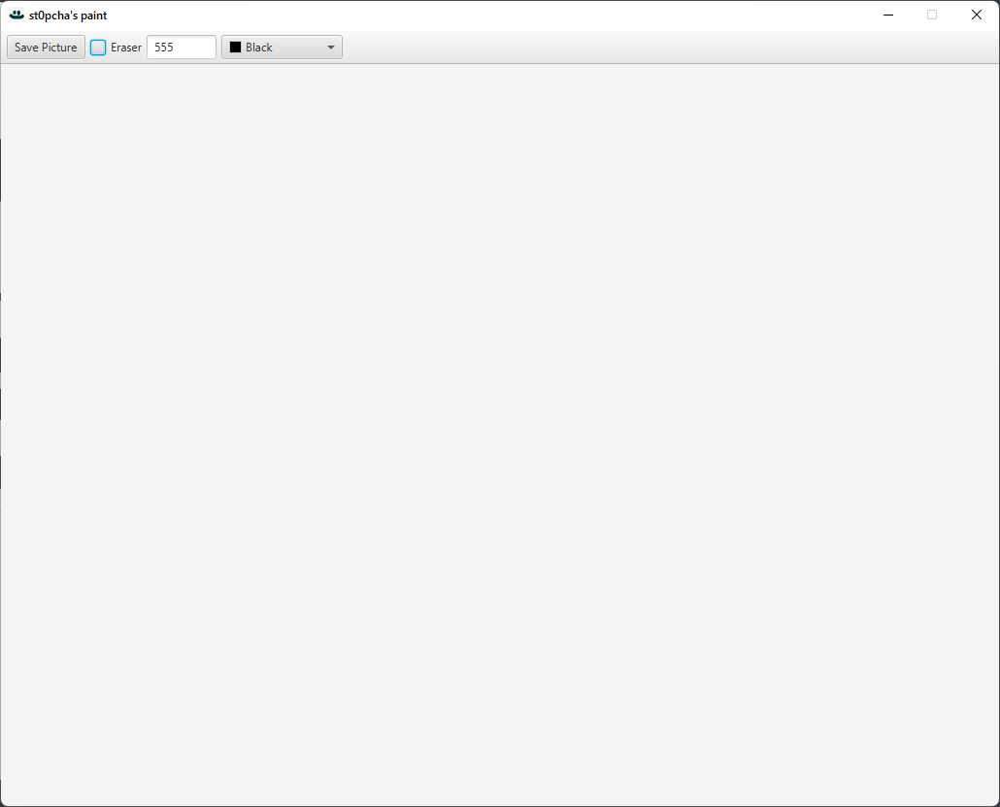

# 🖼️ Faint Paint

### 🏃‍♂️ How to install?
1. Download project
2. Build project
3. Run app with `java -jar paint.jar`

Other way:
1. Download [paint.jar](https://github.com/st0pcha)
2. Run app with `java -jar paint.jar`

